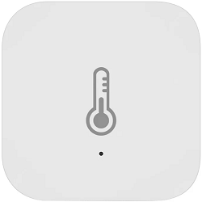
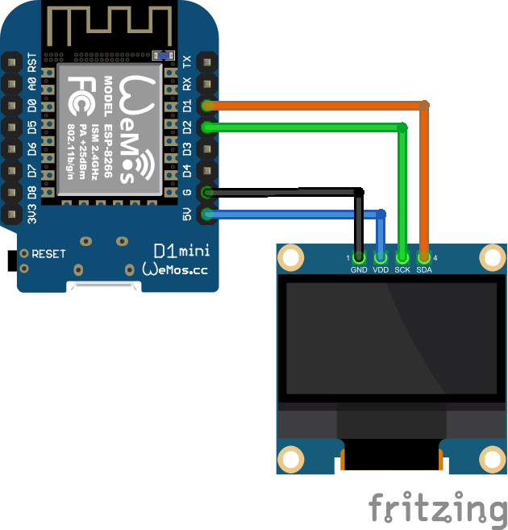
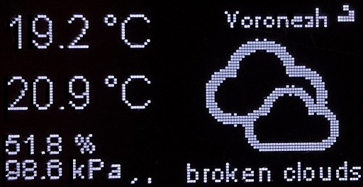

# Temperature display for aqara sensor

This is a program for Wemos D1 mini to display information from 
two temperature and humidity sensors Xiaomi Aqara. Like this:

This program works with Xiaomi Aqara Gateway Hub V2 in developer mode. 
This program can connect to the hub through a TCP port using WI-FI. 
Then the hub can be connected to the sensor using the ZigBee protocol, 
and you can see the information from the sensor.
You need to configure this program is to find the sids of your sensors.

It can also get information from openweathermap from the Internet.
The display looks like this:

